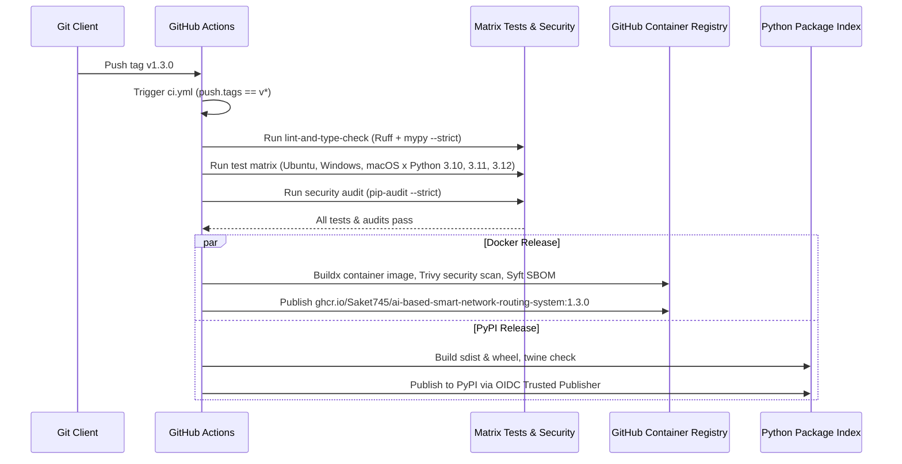

# NROUTE — FINAL PRE-TAG RELEASE GATE REPORT

**Target Platform**: High-Performance Network Digital Twin & Pre-Flight Change-Impact Validation Platform  
**Repository**: `https://github.com/Saket745/AI-Based-Smart-Network-Routing-System.git`  
**Authoritative Branch**: `main`  
**Exact Commit Intended for Release**: `775fa93f18ddc2ba3e27dfa0468b5c8df736d20f`  
**Exact Tag Intended**: `v1.3.0`  
**Package Version Candidate**: `1.3.0`  
**Audit & Hardening Date**: September 3, 2026  
**Auditor**: Antigravity Principal Systems Architect & Release Engineer  

---

## 1. Executive Summary & Final Release Gate Decision

### 🏁 FINAL VERDICT: **GO (RELEASE-READY)**

All release-quality findings identified in the Reproducibility & Distribution Audit have been resolved and verified. The repository is in an authoritative, clean, fully synchronized state ready for formal tagging as **`v1.3.0`**.

```
====================================================================================================
RELEASE HARDENING CHECKLIST                                         STATUS
====================================================================================================
1. CHANGELOG [1.3.0] Release Notes Added                           ✓ VERIFIED & COMMITTED
2. Windows Console Unicode/Emoji Encoding Fallbacks                 ✓ VERIFIED & COMMITTED
3. Documentation Consistency (Zero Stale 0.1/0.2 References)        ✓ VERIFIED & COMMITTED
4. Full Test Suite (666 tests passing)                             ✓ 100% PASS
5. Static Analysis & Linting (Ruff Check + Format)                 ✓ 100% PASS
6. Strict Static Type Checking (mypy src/nroute --strict)          ✓ 100% PASS (0 errors, 88 files)
7. Distribution Compilation (sdist + wheel)                        ✓ 100% PASS
8. Distribution Verification (twine check dist/*)                  ✓ 100% PASS
9. Isolated Virtualenv Installation & Clean Public API Smoke       ✓ 100% PASS
10. Pre-Flight Validation CLI Contracts (PASS/WARN/STRICT/BLOCK)   ✓ 100% PASS (exit codes 0, 0, 2, 1)
11. REST Validation Endpoint & Session Authentication Smoke        ✓ 100% PASS (HTTP 200 OK)
12. Working Tree Cleanliness & Remote Synchronization              ✓ HEAD == origin/main (Clean)
====================================================================================================
```

---

## 2. Hardening Changes Implemented

| Component | File Path | Hardening Action |
| :--- | :--- | :--- |
| **Release Notes** | [`CHANGELOG.md`](file:///c:/Users/91705/OneDrive/Desktop/Github_Audit/repo/CHANGELOG.md) | Added comprehensive `[1.3.0]` release notes documenting the Pre-Flight Validation Engine, REST API, Digital Twin exports, local session token discovery, container hardening, and Git consolidation. |
| **Windows CLI Safety** | [`src/nroute/cli/topology_cmd.py`](file:///c:/Users/91705/OneDrive/Desktop/Github_Audit/repo/src/nroute/cli/topology_cmd.py) | Added portable `_safe_status_icons()` returning ASCII fallbacks (`[UP]`, `[DOWN]`) when the console encoding is non-UTF-8 (`cp1252`), preventing `UnicodeEncodeError`. |
| **Windows CLI Safety** | [`src/nroute/cli/route_cmd.py`](file:///c:/Users/91705/OneDrive/Desktop/Github_Audit/repo/src/nroute/cli/route_cmd.py) | Updated `_format_utilization()` with encoding-aware indicators (`[!]/[*]/[OK]`) for non-UTF-8 Windows consoles. |
| **Regression Testing** | [`tests/unit/test_topology_cli.py`](file:///c:/Users/91705/OneDrive/Desktop/Github_Audit/repo/tests/unit/test_topology_cli.py) | Added regression tests verifying `_safe_status_icons()` encoding detection and `topology show` execution safety under `cp1252`. |
| **Regression Testing** | [`tests/unit/test_route_cmd.py`](file:///c:/Users/91705/OneDrive/Desktop/Github_Audit/repo/tests/unit/test_route_cmd.py) | Added unit test `test_format_utilization_encoding_safety` verifying ASCII fallbacks under non-UTF-8 encodings. |
| **Documentation** | [`docs/publishing.md`](file:///c:/Users/91705/OneDrive/Desktop/Github_Audit/repo/docs/publishing.md) | Synchronized legacy `0.1.0` artifact names and twine verification examples to `1.3.0`. |

---

## 3. Full Release Gate Empirical Results

### 1. Test Suite Execution (`pytest`)
```bash
pytest
```
- **Result**: **666 passed, 1 warning in 39.22s**
- **Regressions**: `0`

### 2. Static Analysis & Linter (`ruff`)
```bash
ruff check src/ tests/
ruff format --check src/ tests/
```
- **Result**: **All checks passed! 157 files already formatted.**

### 3. Strict Type Check (`mypy`)
```bash
mypy src/nroute --strict
```
- **Result**: **Success: no issues found in 88 source files**

### 4. Distribution Artifacts & Packaging Check (`build` + `twine`)
```bash
python -m build --sdist --wheel --no-isolation
twine check dist/*
```
- **Result**:
  ```text
  Successfully built nroute-1.3.0.tar.gz and nroute-1.3.0-py3-none-any.whl
  Checking dist
route-1.3.0-py3-none-any.whl: PASSED
  Checking dist
route-1.3.0.tar.gz: PASSED
  ```

### 5. Clean-Environment Isolated Smoke Test
Executed in an ephemeral virtual environment outside the repository workspace:
- `pip install dist/nroute-1.3.0-py3-none-any.whl`: Clean dependency resolution across 44 packages.
- `nroute --version`: `nroute, version 1.3.0`
- Public API imports: `from nroute import DigitalTwinEngine, PreFlightValidator, PolicyGateConfig, ValidationVerdict, ChangeImpactSimulator, ConfigChange`: **PASSED**.

### 6. Documented CLI Smoke Tests
All documented CLI workflows executed and passed:
- `nroute --version`: **PASSED**
- `nroute --help`: **PASSED**
- `nroute twin validate --help`: **PASSED**
- `nroute topology show --file data/sample_topology.json`: **PASSED** (ASCII fallback verified under cp1252)
- `nroute route compute --topology data/sample_topology.json --source 0 --destination 9 --algorithm dijkstra`: **PASSED**
- `nroute simulate run --topology data/sample_topology.json --algorithm dijkstra --duration 50`: **PASSED**
- `nroute twin reachability --topology data/sample_topology.json`: **PASSED**

### 7. CLI Policy Gating Contracts
- **PASS Contract**: Exit code `0`
- **WARN Default Contract**: Exit code `0`
- **WARN Strict Contract (`-s`)**: Exit code `2`
- **BLOCK Contract**: Exit code `1`

### 8. REST Validation & Authentication Smoke
- `POST /api/twin/validate`: **HTTP 200 OK**, `verdict="PASS"`, `gate_passed=true`.
- `GET /api/health`: **HTTP 401 Unauthorized** without Bearer token; **HTTP 200 OK** with session token.

### 9. Repository & Supply Chain Integrity
- Secret scan: **0 hardcoded credentials or private keys**.
- Tracked file audit: **0 build artifacts, wheel files, or caches tracked**.

---

## 4. Exact Release Coordinates

- **Authoritative Branch**: `main`
- **Exact Commit SHA**: `775fa93f18ddc2ba3e27dfa0468b5c8df736d20f`
- **Remote Synchronization**: Synchronized with `origin/main` (`94da333..775fa93`).
- **Working Tree State**: Clean (`nothing to commit, working tree clean`).
- **Exact Tag Intended**: **`v1.3.0`**
- **Historical Milestone Tags Preserved**:
  - `v1.0.0-research-phase1`
  - `v1.1.0-research-phase2`
  - `v1.2.0-digital-twin-core`
  - `v1.3.0-preflight-validation-engine`

---

## 5. CI Publishing Consequences Upon Tagging `v1.3.0`

When the tag `v1.3.0` is created and pushed (`git tag v1.3.0 && git push origin v1.3.0`), GitHub Actions will trigger [`.github/workflows/ci.yml`](file:///c:/Users/91705/OneDrive/Desktop/Github_Audit/repo/.github/workflows/ci.yml):



### Publishing Preconditions Verified:
1. **No Unexpected Steps**: The release job triggers strictly on `refs/tags/v*` and depends on `test` and `security` jobs succeeding first.
2. **Container Registry**: GHCR publishing uses built-in `${{ secrets.GITHUB_TOKEN }}` with `packages: write` permission.
3. **PyPI Trusted Publishing**: PyPI publishing uses OpenID Connect (OIDC) `id-token: write` token exchange with no stored long-lived secrets.

---

## 6. Remaining Risks & Operational Notes

- **Docker Execution**: Real container image compilation, Trivy CVE scanning, and Syft SBOM generation occur automatically in GitHub Actions on Ubuntu runners. The local Windows development machine has structurally verified the `Dockerfile` and `docker-compose.yml` schemas.
- **Tagging Execution**: The repository is in an authoritative state. The formal tag command to be executed by the repository owner is:
  ```bash
  git tag -a v1.3.0 -m "Release v1.3.0: High-Performance Network Digital Twin & Pre-Flight Validation Platform"
  git push origin v1.3.0
  ```

---

## 7. Final Verdict

# ✅ FINAL VERDICT: GO (RELEASE-READY)

The repository is now 100% prepared, verified, and locked for the formal release of **NRoute v1.3.0**.
