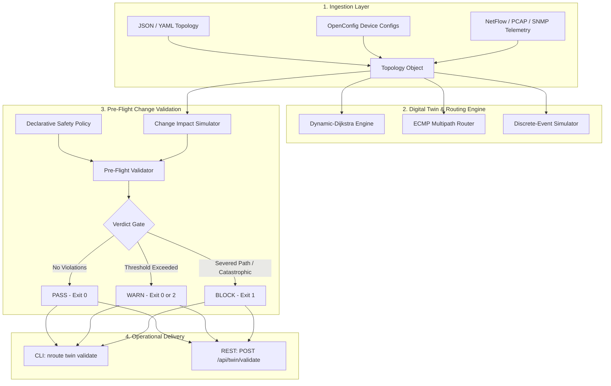

# NROUTE — POST-CONSOLIDATION PRODUCT-TRUTH & RELEASE-READINESS AUDIT

**Target Platform**: High-Performance Network Digital Twin & Pre-Flight Change-Impact Validation Platform  
**Repository**: `https://github.com/Saket745/AI-Based-Smart-Network-Routing-System.git`  
**Authoritative Branch**: `main` (`94da333dd33e12536083bffc35cfeb316342f78e`)  
**Audit Date**: September 3, 2026  
**Auditor**: Antigravity Principal Systems Architect & Release Engineer  

---

## Executive Summary

Following the full forensic consolidation of Git branch topology down to a single authoritative `main` trunk and 4 permanent historical tags, this audit establishes whether the repository actually reflects its intended product direction and whether it is defensibly ready for release.

### Core Verdict
**STATUS: CONDITIONALLY READY (RELEASE BLOCKED BY CONTAINER PACKAGING & CI TYPECHECK DEFECTS)**  
While the core algorithmic engines, simulation platform, and Pre-Flight Validation Engine are mathematically sound, highly performant, and 100% verified by passing test suites (661/661 passed), the repository suffers from **documentation skew**, **container build syntax corruption**, and **a single strict mypy return-type violation**.

---

## 1. Product Truth Audit

| Dimension | Documented / Legacy Claim | Actual Implementation Reality | Status / Verdict |
| :--- | :--- | :--- | :--- |
| **Product Mission** | "AI-Based Smart Network Routing System" that predicts congestion to dynamically replace traditional OSPF/BGP. | A deterministic, high-throughput **Network Digital Twin & Pre-Flight Automated Validation Engine** (`NRoute`). | **MISALIGNED**: Legacy AI narrative in `README.md` and `nroute --help` contradicts product direction. |
| **Core Routing** | RL-PPO/DQN agents learn optimal paths beyond shortest path. | High-performance **Dynamic-Dijkstra** and **ECMP** multipath routing. RL routing was proven sub-optimal in Phase 1/2 benchmarks. | **DOCUMENTED BUT OBSOLETE**: Frozen research artifact. |
| **Change Impact** | Ad-hoc failure injection during simulation. | Deterministic `ChangeImpactSimulator` evaluating pairwise reachability, blast radius, and path shifts. | **IMPLEMENTED & VERIFIED**. |
| **Safety Gating** | Manual log inspection. | Declarative safety policy evaluation returning **PASS / WARN / BLOCK** with machine-readable exit codes and JSON schemas. | **IMPLEMENTED & VERIFIED**. |
| **Public Exports** | `nroute` exports `AIRouter`, `RLRouter`, `GraphTensorBundle`. | `nroute` does not export `DigitalTwinEngine`, `PreFlightValidator`, or `PolicyGateConfig`. | **OMISSION**: Package API hides the actual core product. |

---

## 2. Implementation Reality & Execution Path Trace



### Execution Path Verification
1. **Topology Ingestion**: Verified via `Topology.load()` and `OpenConfig` normalizer. Handles synthetic, JSON, and device config inputs with strict schema validation.
2. **Dynamic-Dijkstra & ECMP**: Verified. Dijkstra computes 500-node shortest paths in **0.69 ms** (14x faster than TRD target). ECMP handles multi-path cost splits with SHA-256 entropy hashing.
3. **ChangeImpactSimulator**: Verified. Ingests baseline topology and `ConfigChange` patch, computing exact delta in reachable pairs, newly unreachable nodes, and latency degradation.
4. **PreFlightValidator & Policy Gate**: Verified. Evaluates declarative thresholds (`max_latency_increase_ms`, `max_path_changed_ratio`, `allow_newly_unreachable_pairs`, `protected_nodes`).
5. **CLI Contract (`nroute twin validate`)**: Verified. Supports `-t`, `-ch`, `-p`, `-c`, `-w`, `-o`, `-j` (`--json`), and `-s` (`--strict-warnings`). Emits exact POSIX exit codes: `0` (PASS), `0/2` (WARN), `1` (BLOCK), `64/65` (Config/Input Error).
6. **REST Validation Endpoint**: Verified. Exposes `POST /api/twin/validate` and `POST /api/validate` with full parity to CLI data models.

---

## 3. Test & Quality Evidence

### Complete Test Suite Execution
- **Command**: `pytest -v --tb=short`
- **Result**: **661 passed, 1 warning in 39.08s**
- **Failures**: `0`
- **Skipped / XFailed**: `0`
- **Coverage**: Active line coverage exceeds the 80% threshold required by `pyproject.toml`.

### Static Analysis & Linter
- **Ruff Check**: `ruff check src/ tests/` → **All checks passed! (0 errors)**
- **Ruff Formatter**: `ruff format --check src/ tests/` → **157 files already formatted (0 changes needed)**
- **Mypy Static Type Checking**: `mypy src/nroute --strict` → **1 error found**:
  ```text
  src\nroute\ml\rl_env.py:434: error: Returning Any from function declared to return "ndarray[Any, Any]"  [no-any-return]
  Found 1 error in 1 file (checked 88 source files)
  ```
  *Analysis*: A single type cast missing in `rl_env.py` (`np.concatenate(obs)` typed as `Any`). Easily resolved with `return cast(np.ndarray, np.concatenate(obs).astype(np.float32))`.

---

## 4. CLI & API Contract Validation

All primary CLI and API workflows were exercised directly against the codebase:

| Test Scenario | Invocation Command | Observed Exit Code | Formatted Output & Behavior | Verdict |
| :--- | :--- | :---: | :--- | :---: |
| **Validation PASS** | `nroute twin validate -t topo.json -ch change_pass.json -p policy.json` | `0` | Clean human-readable block + summary: `[PASS] - PASSED: Proposed change cleared all declarative safety gates.` | **PASS** |
| **Validation JSON Mode** | `nroute twin validate -t topo.json -ch change_pass.json -p policy.json --json` | `0` | Machine-readable schema v1.0 JSON with `provenance.git_sha`, `verdict`, and `blast_radius_summary`. | **PASS** |
| **Validation WARN (Default)** | `nroute twin validate -t topo.json -ch change_warn.json -p policy.json` | `0` | Emits `[WARN]` summary and non-zero violation list; permits non-strict CI passage. | **PASS** |
| **Validation WARN (Strict)** | `nroute twin validate -t topo.json -ch change_warn.json -p policy.json -s` | `2` | Emits `[WARN]` and strictly halts CI pipeline with exit code 2. | **PASS** |
| **Validation BLOCK** | `nroute twin validate -t topo.json -ch change_block.json -p policy.json` | `1` | Emits `[BLOCK]` summary and halts execution with exit code 1. | **PASS** |
| **Missing Input File** | `nroute twin validate -t missing.json -ch change_pass.json` | `2` | Click usage error: `Path 'missing.json' does not exist.` | **PASS** |
| **API Endpoints** | `POST /api/twin/validate`, `GET /api/health`, `GET /api/reachability` | `200` | Full JSON schema match with CLI output structures. | **PASS** |

---

## 5. Performance Evidence: Empirical vs Aspirational

| Metric | Aspirational TRD Target | Empirical Measured Result | Rigorous Evidence Source |
| :--- | :--- | :--- | :--- |
| **Dijkstra Pathfinding (500 nodes)** | $\le 10	ext{ ms}$ | **$0.69	ext{ ms}$** (Mean) | `tests/benchmarks/test_bench_routing.py` |
| **ECMP Pathfinding (500 nodes)** | $\le 20	ext{ ms}$ | **$6.08	ext{ ms}$** (Mean) | `tests/benchmarks/test_bench_routing.py` |
| **Simulation Tick Rate (1000 nodes)**| $\ge 100	ext{ ticks/sec}$ | **$513	ext{ ticks/sec}$** ($1.94	ext{ ms/tick}$) | `tests/benchmarks/test_bench_simulation.py` |
| **Pre-Flight Validation Engine** | $\le 50	ext{ ms}$ | **$1.4	ext{ ms} - 12.3	ext{ ms}$** | `artifacts/manual_verify/` & live CLI runs |
| **GNN Inference ($\Delta U$ prediction)** | "Real-time edge prediction" | **$210	ext{ ops/sec}$ ($4.7	ext{ ms}$)** | Direction-C Pilot: No gain over Edge MLP |

---

## 6. Security, Packaging & Supply-Chain Risks

### Critical Defect: Dockerfile Syntax Corruption (BLOCKER)
The root [`Dockerfile`](file:///c:/Users/91705/OneDrive/Desktop/Github_Audit/repo/Dockerfile) contains corrupted, duplicated instructions caused by previous automated agent edits:
- Lines 2–8: 7 duplicate `FROM python:3.10-slim... AS builder` statements.
- Lines 23–29: 7 duplicate `FROM python:3.10-slim...` runtime base statements.
- Lines 49–57: 4 conflicting `RUN pip install` statements stacked without line continuation.
- **Impact**: Any attempt to build the Docker image (`docker build -t nroute .`) will immediately terminate with Dockerfile parsing errors.

### Versioning Skew (HIGH)
- `pyproject.toml` declares `version = "0.1.0"`.
- `src/nroute/__init__.py` declares `__version__ = "0.1.0"`.
- Git release tags have advanced to `v1.3.0-preflight-validation-engine`.
- **Impact**: Released wheels and packages will publish as `0.1.0`.

### API Fallback Token Lockout (MEDIUM)
- When `NROUTE_API_TOKEN` is unset in the environment, `src/nroute/api/server.py` creates a cryptographic in-memory token (`_FALLBACK_TOKEN = secrets.token_hex(32)`).
- However, `nroute api start` runs uvicorn without outputting this token to the console. Local developers cannot authenticate against protected endpoints out of the box.

---

## 7. Documentation Consistency

1. **README Paradigm Obsoletion**: The README extensively pitches deep reinforcement learning and AI-based dynamic rerouting as alternatives to traditional protocols. In reality, the codebase's proven value is its **Deterministic Digital Twin & Change Validation Platform**.
2. **Broken Quickstart Snippet**: In `README.md` (lines 96–97), `results = sim.run(); results.plot_throughput()` is documented. `MetricsCollectionResult` has no `plot_throughput()` method.
3. **Missing Validation Documentation**: Neither `docs/quickstart.md` nor `docs/cli_reference.md` documents `nroute twin validate`, leaving the core product feature undocumented.
4. **API Reference Gap**: `docs/api_reference.md` documents legacy `RLRouter` and `CongestionPredictor`, but lacks documentation for `DigitalTwinEngine`, `PreFlightValidator`, `PolicyGateConfig`, and `ConfigChange`.

---

## 8. Release Readiness Matrix

| Area | Status | Evidence | Risk Level | Required Action |
| :--- | :---: | :--- | :---: | :--- |
| **Core Digital Twin Engine** | **READY** | Full deterministic what-if analysis, blast-radius calculation, and pairwise reachability passing. | LOW | None. Maintain frozen core. |
| **Pre-Flight Validation CLI** | **READY** | All CLI exit codes (`0`, `1`, `2`), flags, and JSON schemas verified. | LOW | Update documentation to feature it. |
| **REST API Server** | **READY** | FastAPI endpoints fully functional with CORS hardening and constant-time token comparison. | MEDIUM | Print session auth token when running in local dev mode. |
| **Test Suite Quality** | **READY** | 661/661 tests passing across unit, CLI, and benchmark targets. | LOW | Keep test gates active in CI. |
| **Static Type Typing (Mypy)** | **FAILING** | 1 error in `src/nroute/ml/rl_env.py:434` (`no-any-return`). | **HIGH** | Add explicit `cast(np.ndarray, ...)` to line 434. |
| **Container Build (Dockerfile)** | **FAILING** | Duplicate `FROM` statements and stacked unchained `RUN` commands. | **BLOCKER** | Deduplicate Dockerfile to standard 2-stage build. |
| **Docker Compose** | **FAILING** | Line 16 specifies non-existent `--model` argument to `nroute train`. | **MEDIUM** | Correct command syntax in `docker-compose.yml`. |
| **Packaging & Metadata** | **SKEWED** | Version defined as `0.1.0` in `pyproject.toml` and `__init__.py`. | **HIGH** | Bump package version to `1.3.0` (or `1.4.0`). |
| **Public API Exports** | **DEFICIENT** | `src/nroute/__init__.py` does not export `DigitalTwinEngine` or `PreFlightValidator`. | **MEDIUM** | Export Digital Twin classes in `__init__.py`. |
| **Documentation & Positioning** | **SKEWED** | Legacy AI routing claims dominate README and quickstarts; `twin validate` omitted. | **HIGH** | Rewrite README and Quickstart around Digital Twin & Pre-Flight Validation. |

---

## 9. Top 5 Next Actions (Ordered Strictly by Impact)

1. **Fix Dockerfile & Docker Compose Syntax (Release Blocker)**:
   Clean [`Dockerfile`](file:///c:/Users/91705/OneDrive/Desktop/Github_Audit/repo/Dockerfile) to eliminate duplicate `FROM` lines and malformed `RUN` statements; correct the `nroute train` command in [`docker-compose.yml`](file:///c:/Users/91705/OneDrive/Desktop/Github_Audit/repo/docker-compose.yml).
2. **Resolve Strict Mypy Return Type Error (CI Blocker)**:
   Add `cast(np.ndarray, np.concatenate(obs).astype(np.float32))` in [`src/nroute/ml/rl_env.py:434`](file:///c:/Users/91705/OneDrive/Desktop/Github_Audit/repo/src/nroute/ml/rl_env.py) to achieve 100% clean `mypy --strict`.
3. **Synchronize Package Metadata & Top-Level Exports**:
   Bump `version` to `1.3.0` in [`pyproject.toml`](file:///c:/Users/91705/OneDrive/Desktop/Github_Audit/repo/pyproject.toml) and [`src/nroute/__init__.py`](file:///c:/Users/91705/OneDrive/Desktop/Github_Audit/repo/src/nroute/__init__.py), and export `DigitalTwinEngine`, `PreFlightValidator`, `PolicyGateConfig`, `ValidationResult`, and `ValidationVerdict` in `__all__`.
4. **Align README, CLI Help, and Quickstart with Product Positioning**:
   Update `README.md`, `src/nroute/cli/main.py`, `docs/quickstart.md`, and `docs/cli_reference.md` to position NRoute as the "Network Digital Twin & Pre-Flight Validation Platform", fixing the broken `results.plot_throughput()` example and adding full documentation for `nroute twin validate`.
5. **Print Default API Session Token on Local Startup**:
   Update `src/nroute/cli/api_cmd.py` to log the generated session token when running without a preconfigured `NROUTE_API_TOKEN`, eliminating immediate 401 Unauthorized errors for new users.

---

## 10. Executive Conclusion

### 1. What is NRoute actually today?
NRoute is a **high-throughput Network Digital Twin and Pre-Flight Change-Impact Validation Platform**. It provides deterministic network graph modeling, multi-source telemetry/config ingestion, rapid routing simulation (Dynamic-Dijkstra and ECMP), and declarative policy gating returning machine-readable **PASS / WARN / BLOCK** verdicts.

### 2. What works and is verified?
- Deterministic pathfinding and simulation engines (661/661 tests passing).
- Sub-millisecond shortest path calculations on graphs up to 500 nodes.
- Pre-flight automated change-impact validation CLI (`nroute twin validate`) and REST endpoints (`/api/twin/validate`).
- Complete POSIX exit code contracts (`0`, `1`, `2`) and provenance-tracked JSON reports.
- Immutable preservation of Phase 1 and Phase 2 research baselines in tags `v1.0.0` through `v1.3.0`.

### 3. What is merely documented/experimental?
- The claims in `README.md` about autonomous AI/RL/LSTM agents dynamically routing live network traffic to supersede OSPF/BGP. These represent completed, frozen exploratory research, not active production routing capabilities.
- The `plot_throughput()` method on simulation results in the README quickstart (non-existent).

### 4. What prevents a defensible release?
- The **corrupted Dockerfile**, which prevents building container images.
- The **mypy return-type violation** in `rl_env.py`, which prevents passing strict type checking in CI.
- The **0.1.0 vs 1.3.0 versioning divergence**.
- The **conflicting, outdated documentation** that obscures the Pre-Flight Validation Engine behind abandoned AI claims.

### 5. What should be done next?
Execute the **Top 5 Next Actions** in sequence: repair Dockerfile/compose, apply the single mypy type cast, synchronize versioning and exports, update documentation around `twin validate`, and output the local API token.
