# Multi-Agent AI System Architecture
# Network Route Optimization

**Version:** 1.0  
**Date:** June 11, 2026  
**Author:** Saket  
**Repository:** https://github.com/Saket745/AI-Based-Smart-Network-Routing-System  
**Companion Docs:** [PRD](file:///c:/Users/mssak/OneDrive/Desktop/Network%20Route%20Optimizer/PRD.md) · [TRD](file:///c:/Users/mssak/OneDrive/Desktop/Network%20Route%20Optimizer/TRD.md) · [Implementation Plan](file:///c:/Users/mssak/OneDrive/Desktop/Network%20Route%20Optimizer/Implementation_Plan.md)

---

## 1. System Overview

The multi-agent architecture decomposes network route optimization into **7 specialized agents**, each owning a distinct responsibility. An **Orchestrator Agent** coordinates the entire pipeline, routing tasks, validating outputs, and driving feedback loops until convergence.

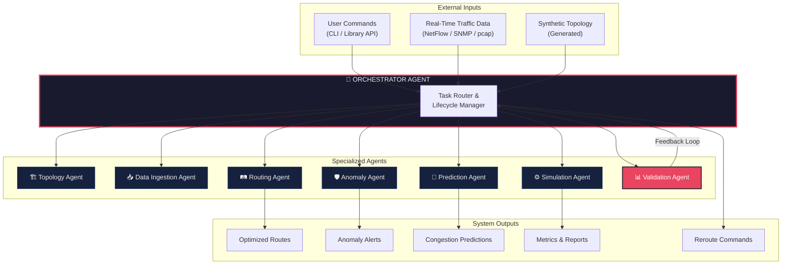

---

## 2. Agent Definitions

### 2.1 🎯 Orchestrator Agent

The brain of the system. Receives all tasks, decomposes them, dispatches to specialist agents, collects results, and drives feedback loops.

| Property          | Detail                                                                                       |
| ----------------- | -------------------------------------------------------------------------------------------- |
| **Role**          | Central coordinator — task decomposition, routing, lifecycle management, and convergence control. |
| **Inputs**        | User commands (CLI/API), real-time traffic data, agent results, validation feedback.          |
| **Outputs**       | Task assignments to agents, final aggregated results, reroute commands, escalation alerts.    |
| **State**         | Task queue, agent status registry, convergence metrics, retry counters, global config.        |

**Decision Logic:**

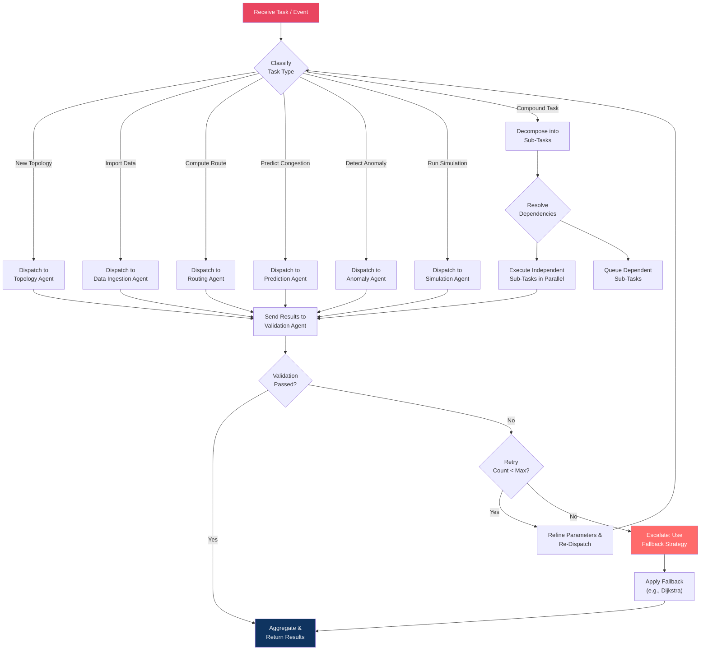

---

### 2.2 🏗️ Topology Agent

Owns all topology operations — generation, mutation, and state management.

| Property          | Detail                                                                                       |
| ----------------- | -------------------------------------------------------------------------------------------- |
| **Role**          | Build, manage, and mutate network topologies (synthetic or imported).                        |
| **Inputs**        | Generation parameters (type, node count, edge probability), or raw data from Ingestion Agent. |
| **Outputs**       | `Topology` object with validated node/edge attributes.                                       |
| **Decision Logic** | Select generator based on type → validate structural properties → assign default attributes → return. |

**Capabilities:**
- Generate: random, scale-free, small-world, fat-tree topologies.
- Mutate: add/remove nodes and edges, toggle link status (up/down), inject latency spikes.
- Validate: ensure graph is connected (or report components), no self-loops, attributes within valid ranges.
- Snapshot: save topology state for rollback during simulation.

---

### 2.3 📥 Data Ingestion Agent

Parses and normalizes external network data into the internal representation.

| Property          | Detail                                                                                       |
| ----------------- | -------------------------------------------------------------------------------------------- |
| **Role**          | Import, parse, validate, and normalize network data from external sources.                   |
| **Inputs**        | Raw files (CSV, JSON, NetFlow, pcap, SNMP exports) + format hint.                            |
| **Outputs**       | Normalized `Topology` and/or `TrafficMatrix` objects.                                        |
| **Decision Logic** | Auto-detect format → select parser → parse → normalize → validate → return or raise `IngestionError`. |

**Error Handling:**
- Malformed files → `IngestionError` with line number and expected format.
- Missing required columns → descriptive error listing missing fields.
- Oversized files (>500MB) → reject with size limit message.
- Partial parse success → return valid records + warning log of skipped rows.

---

### 2.4 🛤️ Routing Agent

Computes optimal routes using classical or AI-based algorithms.

| Property          | Detail                                                                                       |
| ----------------- | -------------------------------------------------------------------------------------------- |
| **Role**          | Compute optimal paths between nodes using the selected routing algorithm.                    |
| **Inputs**        | `Topology`, source node, destination node, algorithm selection, weight metric.               |
| **Outputs**       | `RouteMetrics` (path, total latency, hops, bottleneck bandwidth/utilization).                |
| **Decision Logic** | Select algorithm → compute route → validate path (no loops, all links up) → return or fallback. |

**Algorithm Selection Logic:**

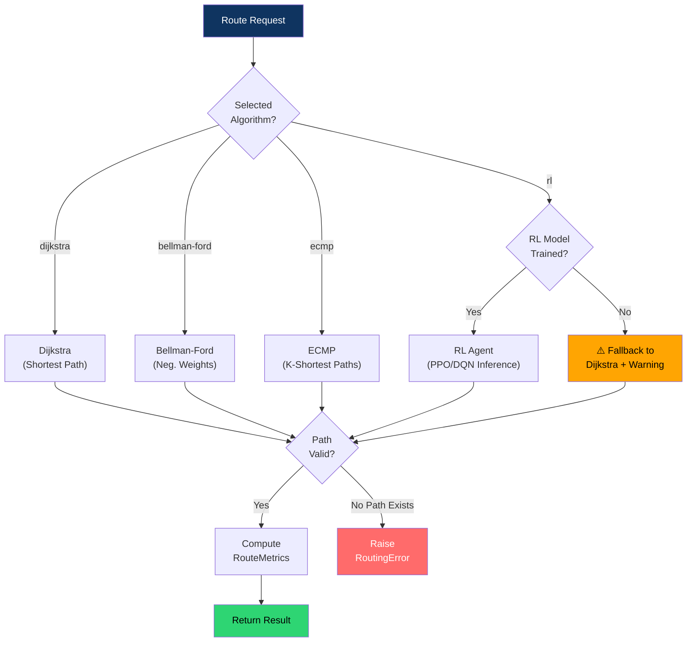

**Fallback Chain:** RL → Weighted Dijkstra → Unweighted BFS → RoutingError.

---

### 2.5 🔮 Prediction Agent

Forecasts future network congestion using ML models.

| Property          | Detail                                                                                       |
| ----------------- | -------------------------------------------------------------------------------------------- |
| **Role**          | Predict per-link congestion probability N minutes into the future.                           |
| **Inputs**        | Current `Topology` state, historical `TrafficMatrix` data, prediction horizon (minutes).     |
| **Outputs**       | Per-link congestion predictions: `{link_id, congested: bool, probability: float}`.           |
| **Decision Logic** | Extract features → select model (XGBoost/LSTM) → predict → threshold → flag at-risk links.  |

**Feature Pipeline:**

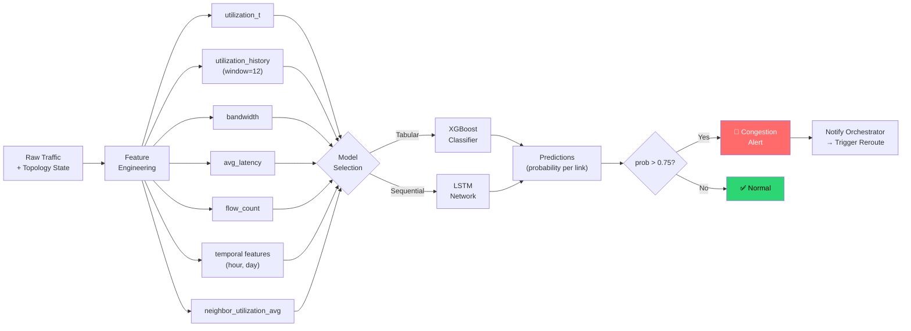

**Training Loop:**
1. Simulation Agent generates historical traffic data.
2. Feature engineering extracts training features.
3. Model trains with cross-validation (80/20 split).
4. Validation Agent checks precision ≥80%, recall ≥75%.
5. If metrics fail → adjust hyperparameters → retrain (max 3 iterations).

---

### 2.6 🛡️ Anomaly Agent

Detects abnormal traffic patterns in real-time or batch mode.

| Property          | Detail                                                                                       |
| ----------------- | -------------------------------------------------------------------------------------------- |
| **Role**          | Detect DDoS floods, link failures, traffic black holes, and other anomalies.                 |
| **Inputs**        | `TrafficMatrix` (current or historical), trained anomaly model.                              |
| **Outputs**       | Per-sample: `{anomaly_score: 0-1, is_anomaly: bool, anomaly_type: str}`.                    |
| **Decision Logic** | Extract features → run Isolation Forest/Autoencoder → score → classify anomaly type → alert. |

**Anomaly Classification Heuristics:**

| Pattern | Anomaly Type | Action |
|---------|-------------|--------|
| High `bytes_per_second` + low `src_ip_entropy` | **DDoS Flood** | Block + reroute |
| Sudden `utilization_delta` spike (>3σ) | **Link Degradation** | Reduce weight, reroute |
| `flow_count` drops to 0 on active link | **Traffic Black Hole** | Mark link down, reroute |
| `latency_spike_flag` = true + high jitter | **Link Failure** | Failover to backup path |

---

### 2.7 ⚙️ Simulation Agent

Runs discrete-event simulations of the entire network under various conditions.

| Property          | Detail                                                                                       |
| ----------------- | -------------------------------------------------------------------------------------------- |
| **Role**          | Execute network simulations with traffic generation, failure injection, and metrics collection. |
| **Inputs**        | `Topology`, routing algorithm, traffic model, failure schedule, duration, seed.               |
| **Outputs**       | `MetricsCollectionResult` (per-tick throughput, latency, loss, utilization, reroute count).   |
| **Decision Logic** | Initialize → per-tick loop (generate → fail → route → forward → collect) → aggregate → report. |

**Simulation Tick Loop:**

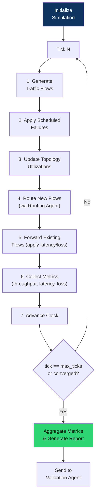

---

### 2.8 📊 Validation Agent

The quality gate. Every agent result passes through validation before being accepted.

| Property          | Detail                                                                                       |
| ----------------- | -------------------------------------------------------------------------------------------- |
| **Role**          | Verify correctness, quality, and performance of all agent outputs.                           |
| **Inputs**        | Agent results + validation criteria (from config or task metadata).                          |
| **Outputs**       | `{valid: bool, issues: list[str], suggestions: list[str]}`.                                  |
| **Decision Logic** | Apply domain-specific validation rules → pass/fail → generate feedback for retry if failed.  |

**Validation Rules by Agent:**

| Agent              | Validation Checks                                                                     |
| ------------------ | ------------------------------------------------------------------------------------- |
| **Topology Agent** | Graph connected? Attributes in valid ranges? No self-loops? Node/edge counts match request? |
| **Ingestion Agent** | All required fields present? Data types correct? No NaN in critical fields? Size within limits? |
| **Routing Agent**  | Path exists in topology? No loops? All links "up"? Latency computation correct? |
| **Prediction Agent** | Precision ≥80%? Recall ≥75%? Probabilities in [0,1]? No NaN predictions? |
| **Anomaly Agent**  | Detection rate ≥90% on known anomalies? False positive rate ≤5%? Scores in [0,1]? |
| **Simulation Agent** | Metrics non-negative? Throughput > 0? No NaN values? Duration matches request? |

---

## 3. Complete Task Flow — End-to-End Pipeline

This flowchart shows how a complete network optimization request flows through all agents:

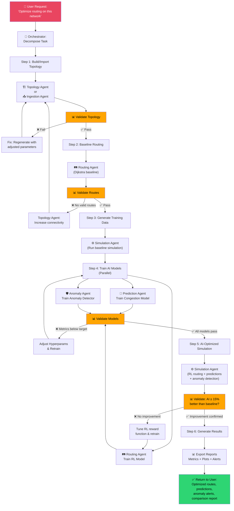

---

## 4. Feedback Loop Mechanisms

The system uses **three types of feedback loops** to ensure quality and convergence:

### 4.1 Immediate Validation Loop (Per-Task)

Every agent result is validated before acceptance. If validation fails, parameters are refined and the agent re-executes.

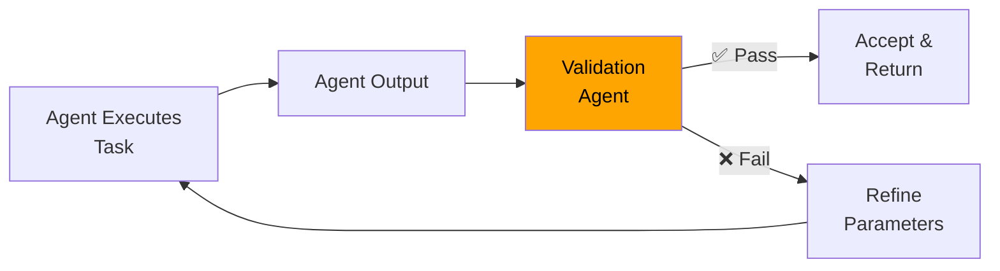

**Convergence Rule:** Max 3 retries per task. After 3 failures → escalate to fallback strategy.

### 4.2 Model Retraining Loop (ML Agents)

When model performance degrades below thresholds, automatic retraining is triggered.

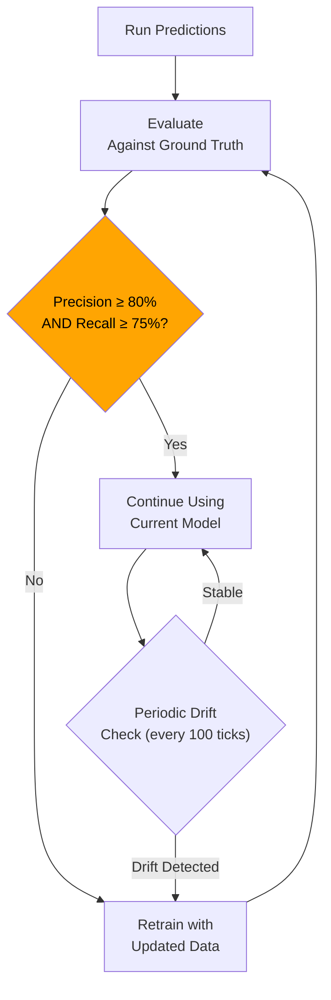

### 4.3 Optimization Convergence Loop (System-Level)

The full pipeline iterates until AI routing demonstrably outperforms the classical baseline.

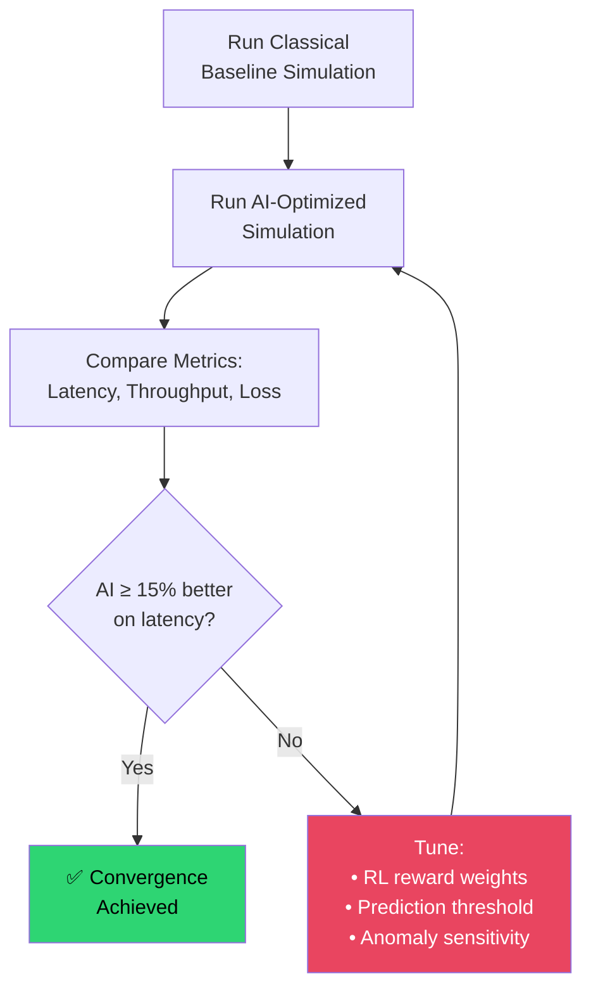

---

## 5. Failure Handling Strategy

### 5.1 Failure Taxonomy

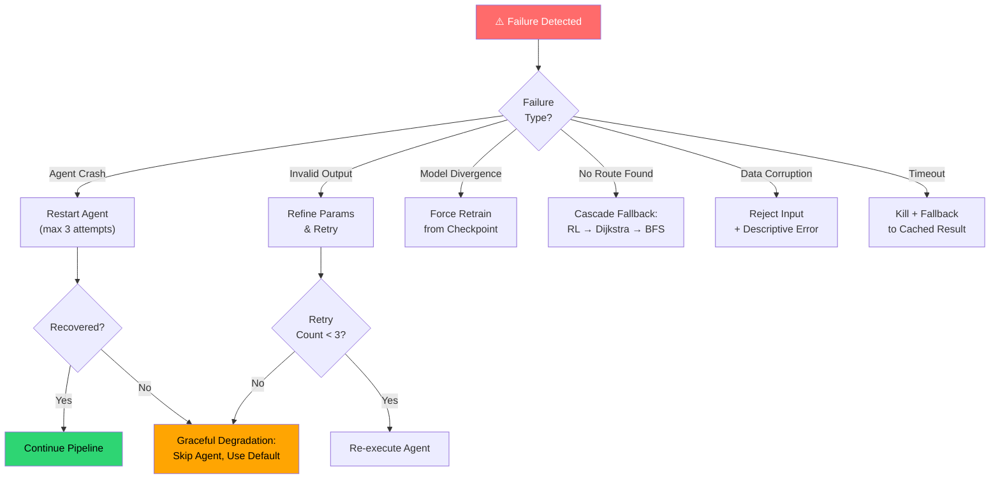

### 5.2 Fallback Strategy Table

| Failure Scenario                    | Primary Action                 | Fallback Action                       | Last Resort                     |
| ----------------------------------- | ------------------------------ | ------------------------------------- | ------------------------------- |
| RL model not trained                | Log warning                    | Use weighted Dijkstra                 | Use unweighted BFS              |
| Congestion prediction fails         | Retry with reduced features    | Use threshold-based heuristic (>85%)  | Disable prediction, route normally |
| Anomaly detection crash             | Restart detector               | Use simple z-score threshold          | Disable detection, log all traffic |
| Simulation timeout (>5 min)         | Reduce tick count              | Return partial results                | Return cached baseline results  |
| Data ingestion parse error          | Try alternate parser           | Skip malformed rows + warning         | Reject file with error details  |
| Topology generation invalid         | Retry with higher connectivity | Use default 20-node random graph      | Raise `TopologyError`           |

### 5.3 Circuit Breaker Pattern

Each agent has a circuit breaker that prevents cascading failures:

```
CLOSED (normal) → on 3 consecutive failures → OPEN (reject all tasks for 30s)
OPEN → after 30s → HALF-OPEN (allow 1 trial task)
HALF-OPEN → if trial succeeds → CLOSED | if trial fails → OPEN
```

---

## 6. Optimization Steps

### 6.1 Route Optimization Pipeline

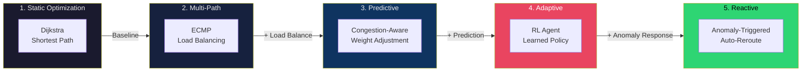

### 6.2 Performance Optimization Techniques

| Level              | Technique                               | Impact                               |
| ------------------ | --------------------------------------- | ------------------------------------ |
| **Algorithm**      | Fibonacci heap Dijkstra                 | O(V log V + E) instead of O(V²)     |
| **Caching**        | LRU cache for repeated route queries    | Avoid recomputation on stable topology |
| **Batch Inference** | Batch ML predictions (100 links/call)  | 50ms per batch vs 10ms × 100 sequential |
| **Lazy Loading**   | Load ML models only on first use        | CLI startup ≤1s                      |
| **Pruning**        | Skip down links before routing          | Reduce graph size for algorithms     |
| **Parallel**       | Train prediction + anomaly models in parallel | 40% reduction in training time |

---

## 7. Scalability Architecture

### 7.1 Scaling Dimensions

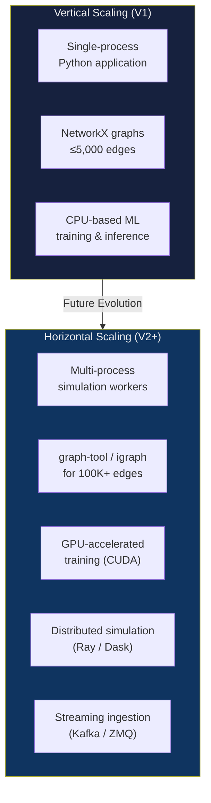

### 7.2 Scaling Strategy by Component

| Component          | V1 (Current)               | V2 (Planned)                            | V3 (Future)                        |
| ------------------ | -------------------------- | --------------------------------------- | ---------------------------------- |
| **Topology**       | NetworkX, ≤5K edges        | igraph/graph-tool, ≤100K edges          | Distributed graph DB (JanusGraph)  |
| **Routing**        | Single-thread algorithms   | Multi-process k-shortest-paths          | GPU-accelerated GNN routing        |
| **ML Training**    | CPU, single-process        | GPU via CUDA, parallel hyperparameter search | Distributed training (PyTorch DDP) |
| **ML Inference**   | CPU, synchronous           | Batch inference, ONNX Runtime           | Edge-deployed models (TensorRT)    |
| **Simulation**     | Single-process, sequential | Multi-process workers (1 per topology)  | Ray-based distributed simulation   |
| **Data Ingestion** | File-based, batch          | Streaming (Kafka consumer)              | Real-time pipeline (Flink)         |
| **Agents**         | In-process function calls  | Async with message queue                | Microservices with gRPC            |

### 7.3 Agent Concurrency Model

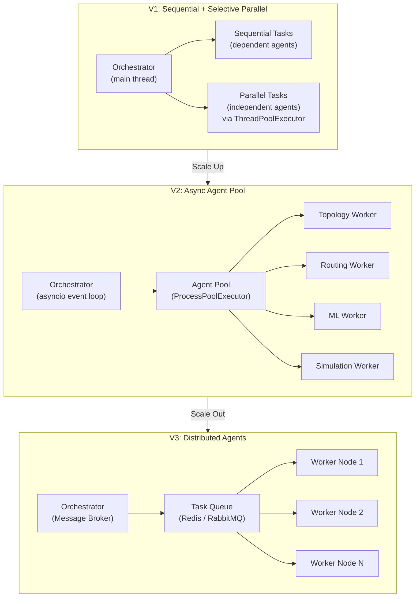

---

## 8. Agent Communication Protocol

### 8.1 Message Format

All inter-agent communication uses a standardized message envelope:

```python
@dataclass
class AgentMessage:
    task_id: str              # Unique task identifier (UUID)
    source_agent: str         # Sender agent name
    target_agent: str         # Receiver agent name
    task_type: str            # e.g., "compute_route", "predict_congestion"
    priority: int             # 0 (low) to 10 (critical)
    payload: dict             # Task-specific data
    metadata: dict            # Timestamps, retry count, parent task ID
    status: str               # "pending" | "in_progress" | "completed" | "failed"
```

### 8.2 Communication Flow

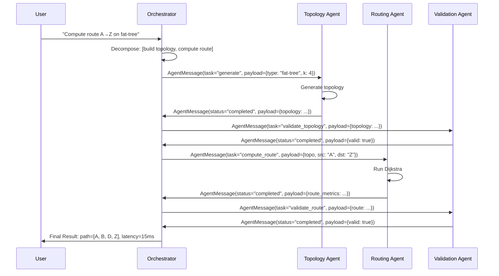

---

## 9. Monitoring & Observability

### 9.1 Agent Health Dashboard (Conceptual)

| Metric                    | Source                | Threshold                | Alert On                    |
| ------------------------- | --------------------- | ------------------------ | --------------------------- |
| Agent response time       | Each agent            | ≤100ms (routing), ≤5s (training) | 3× consecutive threshold breach |
| Task success rate         | Orchestrator          | ≥95% per agent           | Drops below 90%             |
| Validation pass rate      | Validation Agent      | ≥90% first-attempt       | Drops below 80%             |
| Model accuracy drift      | Prediction/Anomaly    | Precision ≥80%           | Drops below 75%             |
| Memory usage              | All agents            | ≤2GB per agent           | Exceeds 3GB                 |
| Queue depth               | Orchestrator          | ≤50 pending tasks        | Exceeds 100                 |

### 9.2 Structured Logging

Every agent logs using `structlog` with:
```json
{
  "timestamp": "2026-06-11T14:30:00Z",
  "agent": "routing_agent",
  "task_id": "abc-123",
  "event": "route_computed",
  "algorithm": "dijkstra",
  "source": "A",
  "destination": "Z",
  "latency_ms": 15.2,
  "hops": 3,
  "duration_ms": 4.7
}
```

---

## 10. Summary: Agent Roster

| Agent              | Icon | Primary Input                | Primary Output               | Feedback Trigger                     |
| ------------------ | ---- | ---------------------------- | ---------------------------- | ------------------------------------ |
| **Orchestrator**   | 🎯  | User commands, agent results | Task assignments, final results | Validation failure, timeout          |
| **Topology**       | 🏗️  | Generation params / raw data | `Topology` object            | Invalid structure, disconnected graph |
| **Data Ingestion** | 📥  | Raw files (CSV/JSON/pcap)    | `Topology` / `TrafficMatrix` | Parse errors, missing fields         |
| **Routing**        | 🛤️  | Topology + src/dst + algo    | `RouteMetrics`               | Invalid path, no route found         |
| **Prediction**     | 🔮  | Topology + traffic history   | Congestion probabilities     | Precision < 80%, drift detected      |
| **Anomaly**        | 🛡️  | Traffic data                 | Anomaly scores + types       | Detection rate < 90%, false positives |
| **Simulation**     | ⚙️  | Topology + config + algo     | `MetricsCollectionResult`    | Timeout, invalid metrics             |
| **Validation**     | 📊  | Any agent output             | Pass/Fail + feedback         | *(Always runs — never skipped)*      |

---

*End of Multi-Agent AI System Architecture*
